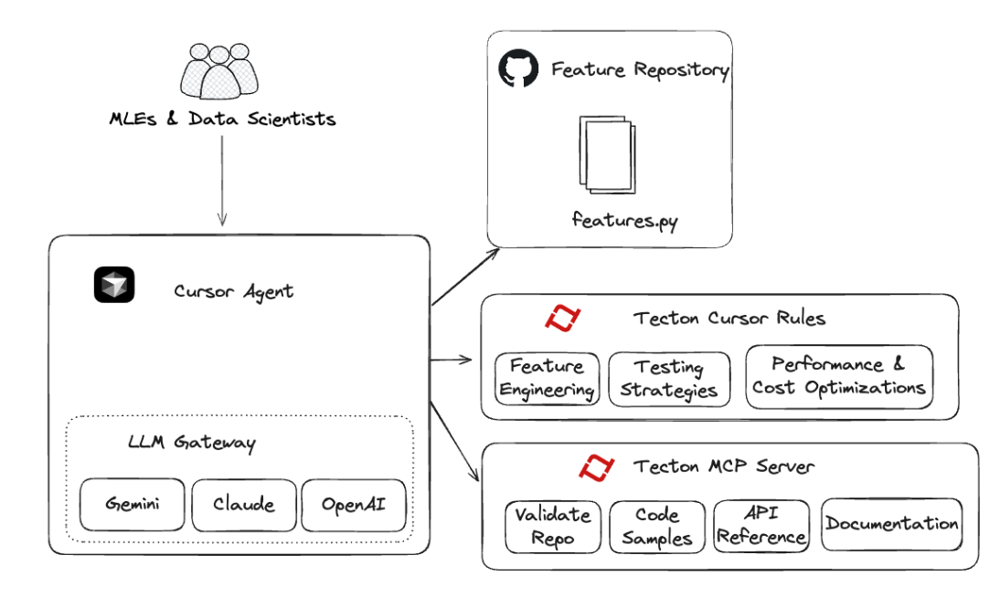
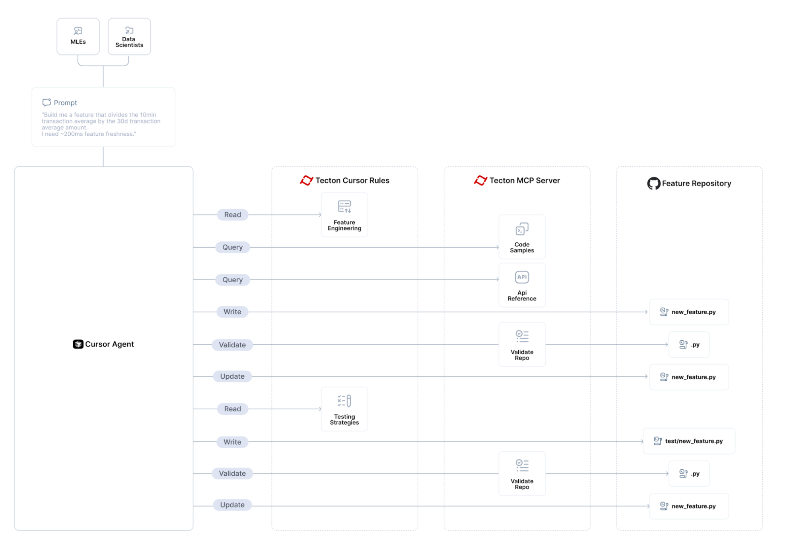

# Tecton MCP Server & Cursor Rules

Tecton's Co-Pilot consists of an MCP Server rules for MCP clients such as Cursor and Claude Code.
Read this [blog](https://medium.com/p/252221865d26) to learn much more.

> ℹ️ **Info**: This guide will walk you through setting up the Tecton MCP server with **this repository** and configuring your **feature repository** to use it while developing features with Tecton.

## Table of Contents

- [Tecton MCP Tools](#tecton-mcp-tools)
- [Quick Start](#quick-start)
- [Setup Tecton with Cursor](#setup-tecton-mcp-with-cursor)
- [Setup Tecton with Claude Code](#setup-tecton-mcp-with-claude-code)
- [Setup Tecton with Augment](#setup-tecton-mcp-with-augment)
- [Architecture](#architecture)
- [How to Update the Tecton MCP Server](#how-to-update-the-tecton-mcp-server)
- [How to Use Specific Tecton SDK Version](#how-to-use-specific-tecton-sdk-version)
- [Troubleshooting](#troubleshooting)
- [Resources](#resources)

## Tecton MCP Tools

The Tecton MCP server exposes the following tools that can be used by an MCP client such as Cursor or Claude Code:

| Tool Name                               | Description                                                                                                                               |
| --------------------------------------- | ----------------------------------------------------------------------------------------------------------------------------------------- |
| `query_example_code_snippet_index_tool` | Finds relevant Tecton code examples using a vector database. Helpful for finding usage patterns before writing new Tecton code.           |
| `query_documentation_index_tool`        | Retrieves Tecton documentation snippets based on a query. Provides context directly from Tecton's official documentation.       |
| `get_full_tecton_sdk_reference_tool`    | Fetches the complete Tecton SDK reference, including all available classes and functions. Use when a broad overview of the SDK is needed. |
| `query_tecton_sdk_reference_tool`       | Fetches the Tecton SDK reference for a specified list of classes or functions. Ideal for targeted information on specific SDK components.   |
| `query_tecton_metrics_tool`             | Queries the Tecton Metrics API. Returns point-in-time system metrics in human-readable or raw OpenMetrics format. |

> ℹ️ **API-based Tools**: If the MCP server is configured with a `TECTON_API_KEY` environment variable, the MCP server will register additional API-based tools including Tecton Feature Services and the Metrics API tool. This makes it possible for agents to query online feature services for fresh features from batch, streaming and real-time data sources and access system metrics.
## Prerequisites

1. Install the `uv` package manager:

   ```bash
   brew install uv
   ```

## Quick Start

1. Clone this repository to your local machine:

   ```bash
   git clone https://github.com/tecton-ai/tecton-mcp.git
   cd tecton-mcp
   pwd
   ```

   **Note:** The directory where you just cloned the repository will be referred to as `<path-to-local-clone>` in the following steps.

2. Verify your installation by running the following command.

   ```bash
   MCP_SMOKE_TEST=1 uv --directory <path-to-local-clone> run mcp run src/tecton_mcp/mcp_server/server.py
   ```

   The command should exit without any errors and print a message similar to `MCP_SMOKE_TEST is set. Exiting after initialization.`. This confirms that your local setup works correctly—Cursor will automatically spawn the MCP server as a subprocess when needed.

3. Log into your Tecton cluster to authenticate the Tecton SDK used by the Tecton MCP server:

   ```bash
   tecton login yourcluster.tecton.ai
   ```

4. Configure Cursor (or any other MCP client) with the MCP server (see below)
- [Setup Tecton MCP with Cursor](#setup-tecton-with-cursor)
- [Setup Tecton MCP with Claude Code](#setup-tecton-with-claude-code)

5. Start AI-Assisted Feature Engineering :-)

Now you can go to your **Feature Repository** in Cursor and start using Tecton's Co-Pilot - directly integrated in Cursor.

View this Loom to see how you can use the integration to build new features: https://www.loom.com/share/3658f665668a41d2b0ea2355b433c616

## Setup Tecton MCP with Cursor

The following is tested with Cursor 0.48 and above

### Configure the Tecton MCP Server in Cursor

Navigate to Cursor Settings -> MCP Tools and click the "Add a Custome MCP Server" button, which will open Cursor's `mcp.json` file.
Add the following configuration to this file. Make sure you modify the path `<path-to-local-clone>` to match the directory where you cloned the repository:

```json
{
    "mcpServers": {
        "tecton": {
            "command": "uv",
            "args": [
                "--directory",
                "<path-to-local-clone>",
                "run",
                "mcp",
                "run",
                "src/tecton_mcp/mcp_server/server.py"
            ]
        }
    }
}
```

### Add Tecton-specific Cursor rules

Symlink the cursorrules from this repository's [`.
cursor/rules` folder](https://github.com/tecton-ai/tecton-mcp/tree/main/.cursor/rules) into your [feature repository](https://docs.tecton.ai/docs/setting-up-tecton/development-setup/creating-a-feature-repository). Using symlinks ensures that any updates to the original rules will automatically be picked up in your feature repository:

```bash
# Symlink the entire .cursor directory in your feature repo
ln -s <path-to-local-clone>/.cursor <path-to-tecton-feature-repo>/.cursor
```

### Verify that the Cursor <> Tecton MCP Integration is working as expected

To make sure that your integration works as expected, ask the Cursor Agent a question like the following and make sure it's properly invoking your Tecton MCP tools:
> Query Tecton's Examples Index and tell me something about BatchFeatureViews and how they differ from StreamFeatureViews. Also look at the SDK Reference.

If no calls are made to Tecton MCP tools, you may need to restart Cursor or reload your Cursor window to ensure new tools are properly registered.

## Setup Tecton MCP with Claude Code

Navigate to your Tecton feature respoitory and run the following command.

```bash
claude mcp add-json tecton-mcp '{
  "command": "uv",
  "args": [
    "--directory",
    "/Users/ravi/Tecton/tecton-mcp",
    "run",
    "mcp",
    "run",
    "src/tecton_mcp/mcp_server/server.py"
  ]
}'
```

You should see the following message:
```txt
Added stdio MCP server tecton-mcp2 to local config
```

Next, start `claude` and run `/mcp` to ensure `tecton-mcp` is connected.

```bash
claude "/mcp"
```

You should see the following:
```txt
tecton-mcp  ✔ connected · Enter to view details
```

### Add Tecton-specific `CLAUDE.md` rules

Symlink the Tecton-recommended [`CLAUDE.md`](https://github.com/tecton-ai/tecton-mcp/tree/main/CLAUDE.md) into your [feature repository](https://docs.tecton.ai/docs/setting-up-tecton/development-setup/creating-a-feature-repository). Using symlinks ensures that any updates to the original rules will automatically be picked up in your feature repository:

```bash
ln -s <path-to-local-clone>/CLAUDE.md <path-to-tecton-feature-repo>/CLAUDE.md
```
## Setup Tecton MCP with Augment 

You can connect Tecton's MCP server to Augment to enable intelligent completion and responses tailored to Tecton's internal codebase.

### Prerequisits
- You have this repository cloned locally.
- You have an IDE with augment installed (e.g., PyChamrm,VSCode)
- You are using latest version of Augment

### Configuration 

Navigate to Augment -> Settings -> Tools -> MCP -> Import from JSON, and import the following configuration(updating `<path-to-local-clone>` to the path where you cloned this repository):

```json
{
  "mcpServers": {
    "tecton": {
      "command": "uv",
      "args": [
        "--directory",
        "/Users/rkitaoka/mcp-demo/tecton-mcp",
        "run",
        "mcp",
        "run",
        "src/tecton_mcp/mcp_server/server.py"
      ]
    }
  }
}
```
You should see the MCP server appear in Augment MCP settings.

### Verify your Connection
- Restart your IDE.
- Ask a Tecton-specific quesiton in Augment
- You should see completions and responses from Tecton's MCP server.
## Recommended LLMs

As of June 2025, the following is the stack ranked list of best performing Tecton feature engineering LLMs in Cursor; this list may evolve over time as new models are released:
- Claude Sonnet 4
- OpenAI o3
- Gemini 2.5 pro exp (03-25)

## Architecture

The Tecton MCP integrates with LLM-powered editors like Cursor to provide tool-based context and assistance for feature engineering:



The overall flow for building features with Tecton MCP looks like:



## How to Update the Tecton MCP Server

To update the Tecton MCP server to the latest version:

1. **Pull the latest changes** from the repository:
   ```bash
   cd <path-to-local-clone>
   git pull
   ```

2. **Close and restart Cursor** to ensure the updated MCP server is loaded.

That's it! The MCP server runs as a subprocess spawned by Cursor, so there's no persistent background service to manually stop or restart. Cursor will automatically use the updated code the next time it needs to communicate with the MCP server.

## How to Use Specific Tecton SDK Version

By default, this tool provides guidance for the latest pre-release of the Tecton SDK. If you need the tools to align with a specific released version of Tecton (for example `1.0.34` or `1.1.10`), follow these steps:

1. **Pin the version in `pyproject.toml`.** Open `pyproject.toml` and replace the existing dependency line

  ```toml
  dependencies = [
    # ... other dependencies ...
    "tecton>=0.8.0a0"
  ]
  ```

  with the exact version you want, e.g.

  ```toml
  dependencies = [
    # ... other dependencies ...
    "tecton==1.1.10"
  ]
  ```

2. **Remove the existing lock-file.** Because `uv.lock` records the dependency graph, you must delete it so that `uv` can resolve the new Tecton version:

  ```bash
  cd <path-to-local-clone>
  rm uv.lock
  ```

3. **Re-generate the lock-file** by re-running **Step&nbsp;2** (the `MCP_SMOKE_TEST=1 uv --directory` command) of the [Quick Start](#quick-start) section. (This will download the pinned version into an isolated environment for MCP and re-create `uv.lock`.)

4. **Restart** Cursor so that the new Tecton version is loaded into the MCP virtual environment.

*Supported versions:* The tools currently support Tecton ≥ 1.0.0. Code examples are not versioned yet – they always use the latest *stable* SDK – however the documentation and SDK reference indices will now match the version you've pinned.

## Troubleshooting

### Cursor <-> Tecton MCP Server integration

Make sure that Cursor shows "tecton" as an "Enabled" MCP server in "Cursor Settings -> MCP". If you don't see a "green dot", run the MCP server in Diagnostics mode (see below)

### Run MCP in Diagnostics Mode

To debug the Tecton MCP Server you can run the following command. Replace `<path-to-local-clone>` with the actual path where you cloned the repository:

```bash
uv --directory <path-to-local-clone> run mcp dev src/tecton_mcp/mcp_server/server.py
```

Note: Launching Tecton's MCP Server will take a few seconds because it's loading an embedding model into memory that it uses to search for relevant code snippets.

Wait a few seconds until the stdout tells you that the MCP Inspector is up and running and then access it at the printed URL (something like http://localhost:5173)

Click "Connect" and then list tools. You should see the Tecton MCP Server tools and be able to query them.

## Resources

- [MCP Python SDK](https://github.com/modelcontextprotocol/python-sdk)
- [MCP Specification](https://github.com/modelcontextprotocol/spec)
- [Blog about this implementation](https://medium.com/p/252221865d26)

## License

This project is licensed under the [MIT License](LICENSE).
