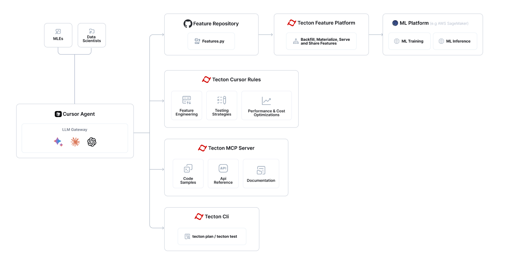

# Tecton MCP Server & Cursor Rules

Tecton's Co-Pilot consists of an MCP Server and Cursor rules.
Read this [blog](https://medium.com/p/252221865d26) to learn much more.

> ℹ️ **Info**: This guide will walk you through setting up the Tecton MCP server with **this repository** and configuring your **feature repository** to use it while developing features with Tecton.

## Table of Contents

- [Quick Start](#quick-start)
- [Tecton MCP Tools](#tecton-mcp-tools)
- [Architecture](#architecture)
- [Setup Tecton with Cursor](#setup-tecton-with-cursor)
- [How to Use Specific Tecton SDK Version](#how-to-use-specific-tecton-sdk-version)
- [Troubleshooting](#troubleshooting)
- [Resources](#resources)

## Quick Start

1. Clone this repository to your local machine:

   ```bash
   git clone https://github.com/tecton-ai/tecton-mcp.git
   cd tecton-mcp
   pwd
   ```
   
   **Note:** The path to the directory where you just cloned the repository will be referred to as `<path-to-your-local-clone>` in the following steps. The `pwd` command in the end will tell you what the full path is.

2. Install the uv package manager:

   ```bash
   brew install uv
   ```

3. Make sure you can run the following command without running into any error. Replace `<path-to-your-local-clone>` with the actual path where you cloned the repository in step 1:

   ```bash
   uv --directory <path-to-your-local-clone> run mcp run src/tecton_mcp/mcp_server/server.py
   ```   

   If you see a message like `{"timestamp": "2025-04-30 12:50:58,343", "level": "INFO", "message": "Tecton MCP Server initialized", "module": "server", "function": "<module>", "line": 233}` it means that everything is working as expected. This command verifies your local setup is correct - Cursor will automatically spawn the MCP server as a subprocess when needed. You can now exit the command and go to the next step.

4. Configure Cursor (or any other MCP client) with the MCP server (see below)


5. Log into your Tecton cluster:

   ```bash
   tecton login yourcluster.tecton.ai
   ```

6. Launch Cursor and start developing features with Tecton's Co-Pilot in Cursor!

## Tecton MCP Tools

The Tecton MCP server exposes the following tools that can be used by an MCP client (like Cursor):

| Tool Name                               | Description                                                                                                                               |
| --------------------------------------- | ----------------------------------------------------------------------------------------------------------------------------------------- |
| `query_example_code_snippet_index_tool` | Finds relevant Tecton code examples using a vector database. Helpful for finding usage patterns before writing new Tecton code.           |
| `query_documentation_index_tool`        | Retrieves Tecton documentation snippets based on a query. Provides context directly from Tecton's official documentation.       |
| `get_full_tecton_sdk_reference_tool`    | Fetches the complete Tecton SDK reference, including all available classes and functions. Use when a broad overview of the SDK is needed. |
| `query_tecton_sdk_reference_tool`       | Fetches the Tecton SDK reference for a specified list of classes or functions. Ideal for targeted information on specific SDK components.   |

## Architecture

The Tecton MCP integrates with LLM-powered editors like Cursor to provide tool-based context and assistance for feature engineering:



The overall flow for building features with Tecton MCP looks like:


## Setup Tecton with Cursor

The following is tested with Cursor 0.48 and above

### Configure the Tecton MCP Server in Cursor

Navigate to Cursor Settings -> MCP and click the "Add new global MCP server" button, which will edit Cursor's `mcp.json` file.
Add Tecton as an MCP server. You can use the following config as a starting point - make sure you modify the path `<path-to-your-local-clone>` to match the directory where you cloned the repository:

```json
{
    "mcpServers": {
        "tecton": {
            "command": "uv",
            "args": [
                "--directory",
                "<path-to-your-local-clone>",
                "run",
                "mcp",
                "run", 
                "src/tecton_mcp/mcp_server/server.py"
            ]
        }
    }
}
```

### Add Cursor rules

Copy the cursorrules from this repository's [`.cursor/rules` folder](https://github.com/tecton-ai/tecton-mcp/tree/main/.cursor/rules) into the `.cursor/rules` folder of your [feature repository](https://docs.tecton.ai/docs/setting-up-tecton/development-setup/creating-a-feature-repository):

```bash
# Create the .cursor/rules directory structure in your feature repository
mkdir -p <path-to-your-feature-repo>/.cursor/rules

# Then copy the rules
cp -r <path-to-your-local-clone>/.cursor/rules/* <path-to-your-feature-repo>/.cursor/rules/
```


### Tecton Login

Log into your Tecton cluster:

```bash
    tecton login yourcluster.tecton.ai
```

### Recommended LLM

As of April 17th, the following is the stack ranked list of best performing Tecton feature engineering LLMs in Cursor:
- OpenAI o3
- Gemini 2.5 pro exp (03-25)
- Sonnet 3.7

### Verify that the Cursor <> Tecton MCP Integration is working as expected

To make sure that your integration works as expected, ask the Cursor Agent a question like the following and make sure it's properly invoking your Tecton MCP tools:
> Query Tecton's Examples Index and tell me something about BatchFeatureViews and how they differ from StreamFeatureViews. Also look at the SDK Reference.

### Start AI-Assisted Feature Engineering :-)

Now you can go to your **Feature Repository** in Cursor and start using Tecton's Co-Pilot - directly integrated in Cursor.

View this Loom to see how you can use the integration to build new features: https://www.loom.com/share/3658f665668a41d2b0ea2355b433c616

## How to Use Specific Tecton SDK Version

By default, this repository installs the **latest pre-release** of the Tecton SDK.  
That means when you first run the MCP server, the newest pre-release build of Tecton will be fetched.

If you need the tools to align with a **specific released version** of Tecton (for example `1.0.34` or `1.1.10`), follow these steps:

1. **Pin the version in `pyproject.toml`.**  
  Open `pyproject.toml` and replace the existing dependency line

  ```toml
  dependencies = [
    # ... other dependencies ...
    "tecton>=0.8.0a0"
  ]
  ```

  with the exact version you want, e.g.

  ```toml
  dependencies = [
    # ... other dependencies ...
    "tecton==1.1.10"
  ]
  ```

2. **Remove the existing lock-file.**  
  Because `uv.lock` records the dependency graph, you must delete it so that `uv` can resolve the new Tecton version:

  ```bash
  cd <path-to-your-local-clone>
  rm uv.lock
  ```

3. **Re-generate the lock-file** by re-running **Step&nbsp;3** (the `uv --directory` command) of the [Quick Start](#quick-start) section.  
  (This will download the pinned version into an isolated environment for MCP and re-create `uv.lock`.)

4. **Restart** Cursor so that the new Tecton version is loaded into the MCP virtual environment.   

*Supported versions:* The tools currently support **Tecton ≥ 1.0.0**.  
Code examples are not versioned yet – they always use the latest *stable* SDK – however the documentation and SDK reference indices will now match the version you pinned.

## Troubleshooting

### Cursor <-> Tecton MCP Server integration

Make sure that Cursor shows "tecton" as an "Enabled" MCP server in "Cursor Settings -> MCP". If you don't see a "green dot", run the MCP server in Diagnostics mode (see below)

### Run MCP in Diagnostics Mode

To debug the Tecton MCP Server you can run the following command. Replace `<path-to-your-local-clone>` with the actual path where you cloned the repository:

```bash
uv --directory <path-to-your-local-clone> run mcp dev src/tecton_mcp/mcp_server/server.py
```

Note: Launching Tecton's MCP Server will take a few seconds because it's loading an embedding model into memory that it uses to search for relevant code snippets.

Wait a few seconds until the stdout tells you that the MCP Inspector is up and running and then access it at the printed URL (something like http://localhost:5173)

Click "Connect" and then list tools. You should see the Tecton MCP Server tools and be able to query them.

## Resources

- [MCP Python SDK](https://github.com/modelcontextprotocol/python-sdk)
- [MCP Specification](https://github.com/modelcontextprotocol/spec)
- [Blog about this implementation](https://medium.com/p/252221865d26)
